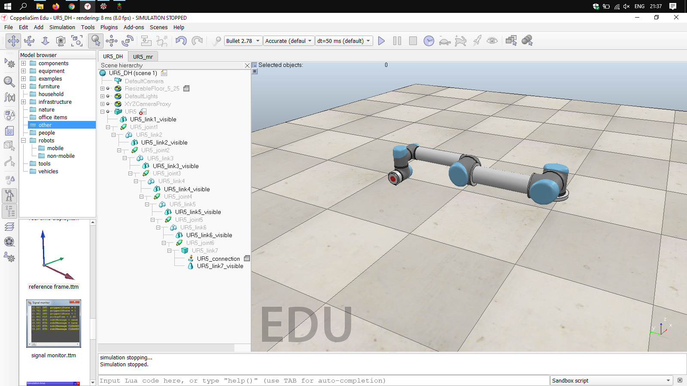
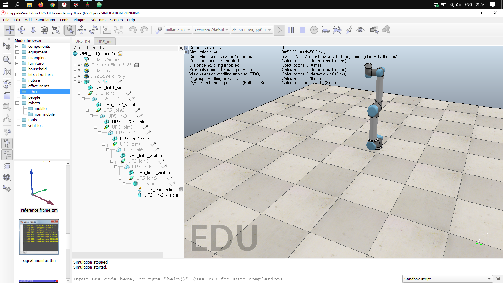

# Inverse Kinematics UR5
Author: Isaac Ayala

## Description

A Python implementation of the inverse kinematics of the UR5 is presented.

`ik_ur5.py` : Main script to execute. Gets the parameters for the UR5 and solves the inverse kinematics of the system for the position written in the code. Connects to CoppeliaSim and sets the new target location. Returns the final position of the robot's end effector.

`sim.py`, `simConst.py` `remoteApi.dll`, `remoteApi.so`:  CoppeliaSim libraries to connect with Python.

`UR5_DH.ttr` : CoppeliaSim robot scene for the DH parameters. Use this scene for simulations.

## Requirements

`Spyder4` inside conda environment base

`CoppeliaSim 4.X`

## Execution

1. Load the `UR5_DH.ttr` scene in CoppeliaSim and run the simulation.
2. Run the script `ik_ur5.py` in Spyder. Check that the simulation in CoppeliaSim wasn't aborted. If it stopped, just press the "play" button again in CoppeliaSim, it will pick up from where it left off.

Note: you can run the Python script again without resetting or stopping the simulation in CoppeliaSim (Tested in Windows 10).

## Results

Robot moves to the desired position/configuration from the home configuration in the DH convention.

+ Original position/configuration

+ Final position/configuration

## References

+ [Denavit-Hartenberg parameters for the UR5](https://www.universal-robots.com/articles/ur-articles/parameters-for-calculations-of-kinematics-and-dynamics/)
+ [Modern Robotics](http://hades.mech.northwestern.edu/index.php/Modern_Robotics)
+ Notes on the Geometric Jacobian by Alvaro Paz and Gustavo Arechavaleta
